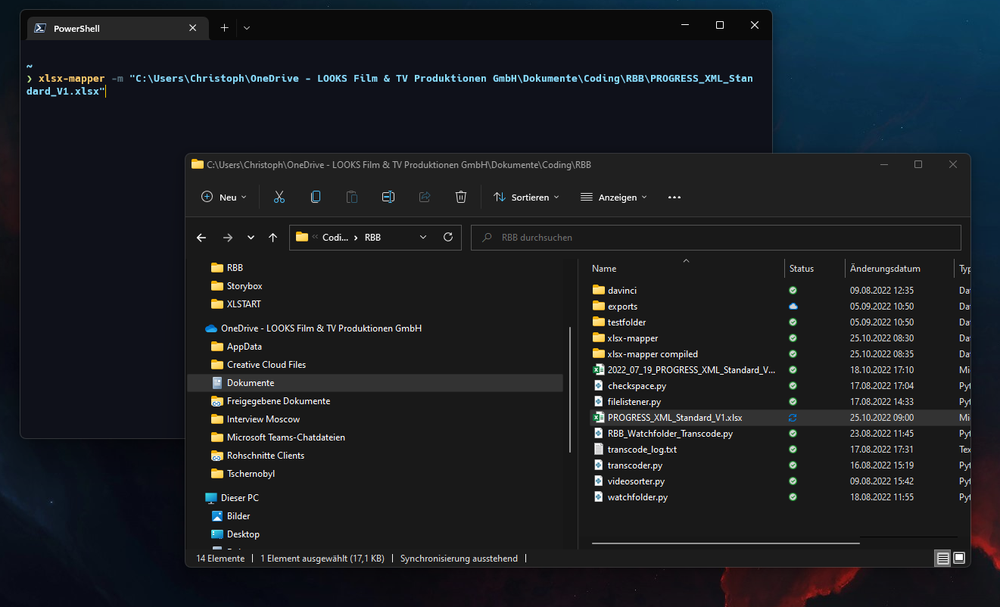

# xlsx-mapper
Command Line interface that maps Metadata from Excel-Template to EditShare Metadata-Fields 

## Install
Download & run xlsx-mapper.msi

## How to use
Starte Eingabeaufforderung / Windows Powershell
Empfehlung: [Windows Terminal](https://learn.microsoft.com/en-us/windows/terminal/install)

#### Zeigt hilfe an: <code>xlsx-mapper -h</code>

#### Einmalige konfiguration eines EditShare users: <code>xlsx-mapper -c</code>
Username & password werden in einer Datei gespeichert, daher muss <code>xlsx-mapper -c</code> nur einmalig ausgeführt werden. <code>xlsx-mapper -c</code> kann aber erneut ausgeführt werden z.B. zum umloggen eines Users.

#### Mapping: <code>xlsx-mapper -m dateipfad</code>
file.xlsx kann per drag'n'drop in das Consolenfenster gezogen werden.

Script kann mit Strg-C unterbrochen werden.

## Funktion
<code>Mapping-ID</code> entspricht dem Clipnamen des Assets auf dem EditShare. Diese ID ist frei zu wählen, sollte möglichst einzigartig sein. Clipnamen entsprechen dem Filenamen vor dem Ingesten. 

Script macht advanced search: Clipname is Mapping-ID

bei treffer werden alle Werte die in den Spalten der Excel vorhanden (benennung identisch wie Metadatenfeld im EditShare z.B.: <code>006 Source</code>, <code>048 Rights Status</code> usw.) in die entsprechenden Felder des ES gemapped. Spalten deren benennung fremd ist werden ignoriert. 

Werte der Felder müssen, falls vom EditShare durch Select/Multiselect vorgegeben, identisch sein.

Werte für Boolean Felder: Yes / No

Nach dem Mapping wird noch der Clipname geändert. Der neue Clipname setzt sich wie folgt zusammen: <code>001 Identifier__014 Original Title</code>

Die Spalten <code>001 Identifier</code> und <code>014 Original Title</code> sind daher immer notwendig.

User die das Tool benutzen benötigen "Metadata write Access" und "Locked Metadata write Access". Es werden nur Assets auf den Spaces gemapped für die der configurierte User berechtigung hat.

